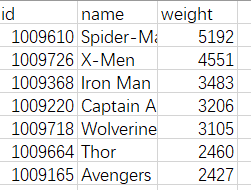

# marvel-gephi
## 项目内容  
调用marvel API获取marvel英雄id，及与英雄相关的故事数，并储存在mongodb数据库中；生成gephi所需文件（这里以csv文件为例）；使用gephi生成英雄关系图谱。
## 项目思路
> 1、使用第三方库marvel，获取marvel所有英雄，并根据与英雄相关故事数排序
> > 1.1 marvel库<https://pypi.org/project/marvel/> 将官方API<https://developer.marvel.com/docs>进行了封装，更方便使用，当然密钥还是要自己去官网申请的； 
1.2 选择一定数量的相关故事数多的marvel英雄(一共1491位英雄)进行分析。

> 2、熟悉gephi的常用操作，如基本界面、布局及统计的使用
> > 2.1 查看官方新手文档<https://gephi.org/users/quick-start/>，了解基本操作，及相应设置

> 3、本次分析主要在于查找marvel英雄故事数最多的前n位英雄的人物关系，所以数据抓取时，要根据自己的目的进行抓取，这是最重要的。
> > 3.1 再次强调先思考自己需要的数据，当然只是想尝试一下，探索未知的秘密也是极棒的。

## 运行环境
* Windows10
* python 3.7.2
* mongodb
## 所需python库
* marvel
* requests
* pymongo
## 文件说明
* marvel_gephi.py:代码文件
  * 代码解释见代码内注释。
## gephi使用
* 查看官方新手文档<https://gephi.org/users/quick-start/>。
* 本次使用输入gephi文档格式：

节点数据：

边数据：

* 部分gephi设置

外观设置：

layout（布局）设置：

统计部分：

## 一些小提议
> 记得去官网申请一下密钥，地址在这：<https://developer.marvel.com>。
> 注意官网说的速率是一天3000次，基本上也是足够了，但是注意marvel官网好像是美国时间，具体的时间不清楚，我们可能和这个接口的更新时间需要倒时差。
> 最后，有问题敬请指出；大家玩的愉快。
> 效果图：

36：

100:

