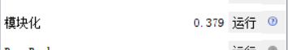

# marvel-gephi
## 项目内容  
调用marvel API获取marvel英雄id，及与英雄相关的故事数，并储存在mongodb数据库中；生成gephi所需文件（这里以csv文件为例）；使用gephi生成英雄关系图谱。
## 项目思路
> 1、使用第三方库marvel，获取marvel所有英雄，并根据与英雄相关故事数排序
> > 1.1 marvel库<https://pypi.org/project/marvel/> 将官方API<https://developer.marvel.com/docs>进行了封装，更方便使用，当然密钥还是要自己去官网申请的； 
1.2 选择一定数量的相关故事数多的marvel英雄(一共1491位英雄)进行分析。

> 2、熟悉gephi的常用操作，如基本界面、布局及统计的使用
> > 2.1 查看官方新手文档<https://gephi.org/users/quick-start/>，了解基本操作，及相应设置

> 3、本次分析主要在于查找marvel英雄故事数最多的前n位英雄的人物关系，所以数据抓取时，要根据自己的目的进行抓取，这是最重要的。
> > 3.1 再次强调先思考自己需要的数据，当然只是想尝试一下，探索未知的秘密也是极棒的。

## 运行环境
* Windows10
* python 3.7.2
* mongodb
  * marvel返回json格式文件，所以选择mongodb方便数据存储。
## 所需python库
* marvel
* requests
* pymongo
## 文件说明
* marvel_gephi.py:代码文件
  * 代码解释见代码内注释。
* 抓取步骤(建议抓取前先抓取页面进行分析，再决定抓取策略),对于后面要使用的gephi来说我们就需要一个节点文件与一个边文件；
> 1、获取marvel英雄所有角色（共1491个）：store.charac(); 生成节点文件：node()
> > 1.1 官网<https://developer.marvel.com/>注册后，显示限制抓取速率3000/day。 
1.2 由我这边抓取实际情况，每次最多请求100个角色信息，则15次就可抓取完成，抓取异常出现情况较少，所以出现问题就对错误处，重新抓取，直到成功。抓取成功后直接存入mongodb中 
1.3 从数据库中取出英雄及对应的故事数后，由故事数最多的前99名英雄的 id，name，相关联故事数；组成初步的节点文件

> 2、抓取与英雄相关的所有故事：store_stories(); 更新节点文件：update_character()；生成边文件：edge()
> > 2.1 由节点文件（见inode.csv）可知，将99名角色相关的故事数总共有约70000多条，每次可抓100条,大概抓取700多次。此时抓取时要注意：
> > > a 可能因为网络等问题不能一次抓取成功，这时就需要输出错误信息；首先将每一位角色信息争取抓完，抓取不完就将 角色id与当前抓取次数 保存在本地文件中，然后再根据log文件手动抓取，存入数据库。 
b 由store_stories()抓取的故事文件可发现时间抓取故事数与前文store_charac()抓取数目不一样,以实际抓取为准，更新节点文件相关的故事数。 
> 
c 最后就是边文件的获得，内容是两两角色id及相关联的故事数。
> 

先来一张gephi生成的图片
36：

## gephi使用
* 查看官方新手文档<https://gephi.org/users/quick-start/>。
* 本次使用输入gephi文档：inode.csv,iedge.csv;格式：

节点数据：

> 

边数据：

> 

* 部分gephi设置

外观设置：

> 

layout（布局）设置--布局算法选择：Fruchterman Reingold：

> 

统计部分-点击运行模块化：

> 
## 一些小提议
> 记得去官网申请一下密钥，地址在这：<https://developer.marvel.com>。
> 注意官网说的速率是一天3000次，基本上也是足够了，但是注意marvel官网好像是美国时间，具体的时间不清楚，我们可能和这个接口的更新时间需要倒时差。
> 最后，有问题敬请指出；大家玩的愉快。
> 效果图：
25：

36：

99:

